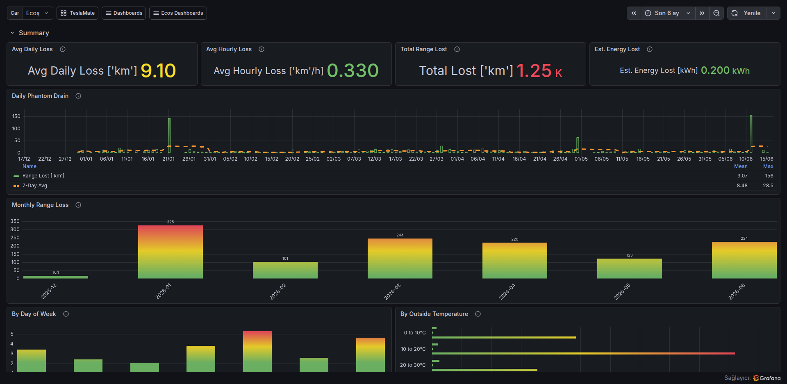
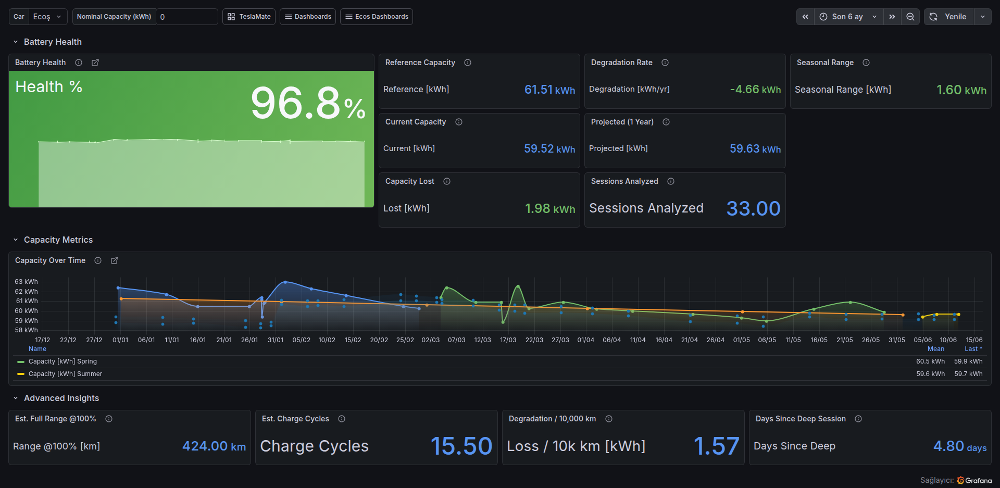
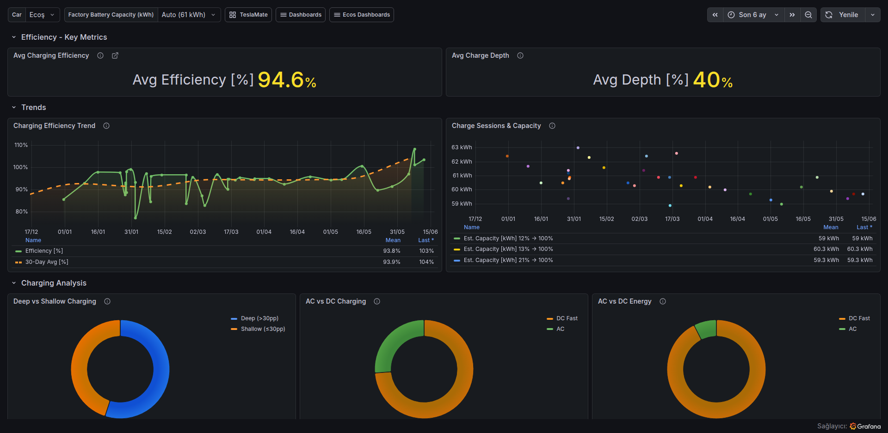
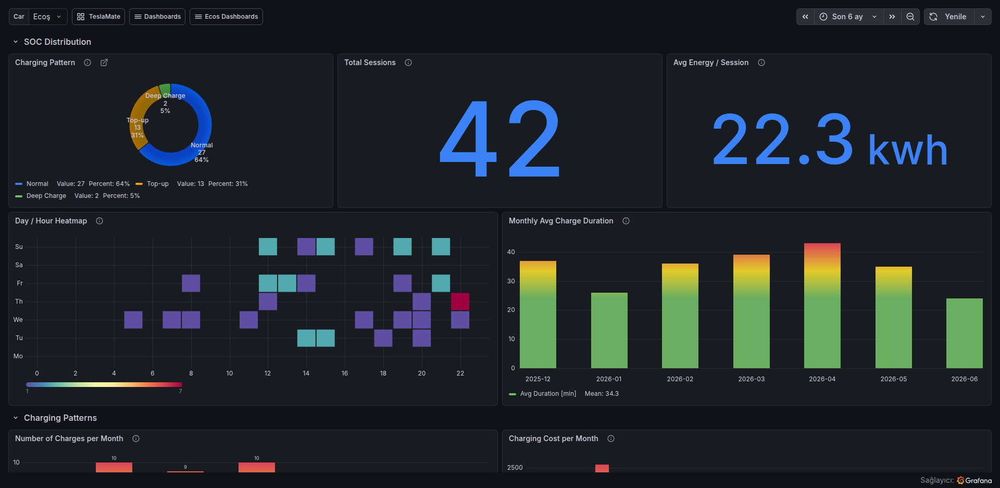

# TeslaMate Ecos Dashboards

[](https://opensource.org/licenses/MIT)
[](https://grafana.com)

> **Why "Ecos"?** Ecos is the name of the author's Tesla vehicle. These dashboards were built and tested on that car — hence the repository and folder name *Teslamate-EcosDashboards*.

A collection of custom **Grafana** dashboards for TeslaMate that provide analyses not available in any existing dashboard — **phantom drain**, **battery capacity estimation**, and **charging habits** insights.

Each dashboard is a separate, focused view:

| Dashboard | Panels | Purpose |
|-----------|--------|---------|
| **Phantom Drain** | 9 | Range and energy lost while parked, patterns by day-of-week and temperature |
| **Battery Capacity & Degradation** | 20 | Real kWh capacity estimation, degradation tracking, temperature/charger-type impact, projected range |
| **Charging Efficiency & Details** | 8 | Charging efficiency, AC vs DC breakdowns, deep vs shallow charging, session analysis |
| **Charging Habits** | 12 | Charging Pattern donut, Day/Hour heatmap, AC/DC energy trend, cost analysis, idle time, location breakdown |

---

## Dashboards

### Phantom Drain



| Panel | Type | Description |
|-------|-----|-------------|
| Avg Daily Range Loss | Stat | Average daily range loss in selected period |
| Avg Hourly Range Loss | Stat | Average range lost per hour while parked |
| Total Range Lost | Stat | Cumulative range lost in selected period |
| Est. Energy Lost (kWh) | Stat | Estimated energy lost using car efficiency factor |
| Daily Phantom Drain | Time Series | Range lost between drives daily, with 7-day moving average |
| Monthly Total Range Loss | Bar Chart | Bar chart comparing total loss per month |
| Phantom Drain by Day of Week | Bar Chart | Average drain broken down by weekday |
| Phantom Drain vs Outside Temperature | Heatmap | Correlation between temperature and drain rate |
| Drain Rate Distribution | Histogram | Distribution of range loss per parking interval |

### Battery Capacity & Degradation



| Panel | Type | Description |
|-------|-----|-------------|
| Battery Health | Stat | Current capacity as a percentage of the reference capacity (auto-detected max or manual override) |
| Capacity Over Time | Time Series | Per-session capacity estimate with linear trend line, colored by season |
| Reference Capacity | Stat | Maximum capacity ever estimated from all historical charge sessions (or manual override) |
| Current Capacity | Stat | Average capacity from the most recent 50 qualifying charge sessions |
| Capacity Lost | Stat | Difference between reference and current capacity |
| Degradation Rate | Stat | Estimated capacity loss per year from linear regression |
| Projected (1 Year) | Stat | Estimated capacity after one year at current degradation rate |
| Sessions Analyzed | Stat | Number of qualifying charge sessions used |
| Seasonal Range | Stat | Difference between highest and lowest seasonal average capacity |
| Est. Full Range @100% | Stat | Estimated full range using current capacity and car efficiency |
| Est. Charge Cycles | Stat | Total energy charged divided by current capacity |
| Degradation / 10,000 km | Stat | Capacity loss per 10,000 km driven |
| Days Since Deep Session | Stat | Days since the last deep charge session used |
| Capacity vs Outside Temperature | Time Series | Capacity estimate over time with outside temperature overlay |
| Capacity: DC Fast vs AC | Time Series | Capacity estimate comparison between DC fast and AC charging |

### Charging Efficiency & Details



| Panel | Type | Description |
|-------|-----|-------------|
| Avg Charging Efficiency | Stat | Overall energy added / energy used ratio |
| Avg Charge Depth | Stat | Average SOC delta per charge session |
| Charging Efficiency Trend | Time Series | Efficiency over time with per-charge points |
| Charge Sessions & Capacity | Time Series | Per-session capacity estimates over time |
| Deep vs Shallow Charging | Bar Chart | Capacity estimates by charge depth category |
| AC vs DC Charging Count | Pie | Number of AC vs DC fast charging sessions |
| AC vs DC Energy Breakdown | Pie | Energy added by AC vs DC |
| Recent 20 Charge Sessions | Table | Full details: date, location, capacity, efficiency, SOC, type |

### Charging Habits



| Panel | Type | Description |
|-------|-----|-------------|
| Charging Pattern | Donut | Classification of charge sessions: Deep Charge (low→full, green), Top-up (short top-off, orange), Normal (blue) |
| Total Sessions | Stat | Total number of charge sessions in period |
| Avg Energy / Session | Stat | Average energy added per session |
| Day / Hour Heatmap | Heatmap | Traditional heatmap: X=hours (0-23), Y=days (Mon-Sun), color=charging frequency. Spectral color scheme |
| Monthly Avg Charge Duration | Bar Chart | Average session duration per month |
| Number of Charges per Month | Bar Chart | Charging frequency over time |
| Charging Cost per Month | Bar Chart | Monthly cost and energy used |
| AC vs DC Energy Trend | Time Series | Charging energy over time, AC vs DC stacked |
| AC vs DC Charges | Donut | Session count by charger type |
| Top 15 Charging Locations | Table | Top 15 locations with session stats |
| Post-Charge Idle Time | Table | Time car stayed plugged in after full, color-coded |
| Monthly Charging Stats | Table | Comprehensive monthly summary |

---

## Installation

### Method 1: Docker Compose with Auto-Provisioning (Recommended)

Add these volume mounts to the `grafana` service in your `docker-compose.yml`:

```yaml
grafana:
  # ... existing configuration ...
  volumes:
    # ... existing volumes ...
    - ./Teslamate-EcosDashboards/provisioning.yml:/etc/grafana/provisioning/dashboards/ecos.yml
    - ./Teslamate-EcosDashboards:/TeslamateEcosDashboards
```

Then recreate the Grafana container to apply new volumes:

```bash
docker compose up -d grafana
```

> **Note:** `docker compose restart` is **not enough** — it doesn't pick up new volume mounts. You must use `docker compose up -d` to recreate the container.

The dashboards will appear in Grafana under the **"Teslamate Ecos"** folder within ~30 seconds. Access them at:

- **Phantom Drain:** `http://<host>:3000/d/ecos-pd-01/phantom-drain`
- **Battery Capacity & Degradation:** `http://<host>:3000/d/ecos-bch-01/battery-capacity-and-health`
- **Charging Efficiency & Details:** `http://<host>:3000/d/ecos-ced-01/charging-efficiency-and-details`
- **Charging Habits:** `http://<host>:3000/d/ecos-ch-01/charging-habits`

They will also appear in the **"Ecos Dashboards"** dropdown in the top navigation.

### Method 2: Manual Import

1. Log in to your Grafana instance
2. Navigate to **Dashboards → New → Import**
3. Upload each JSON file individually
4. Select the **TeslaMate** PostgreSQL datasource
5. Click Import

### Method 3: Clone into Existing TeslaMate Setup

```bash
cd /path/to/TeslaMate
git clone https://github.com/<your-username>/Teslamate-EcosDashboards.git
```

Then add the volume mounts as described in Method 1.

---

## Variables

| Variable | Type | Description |
|----------|------|-------------|
| `car_id` | Query | Select which Tesla vehicle to display |
| `length_unit` | Hidden | Length unit from TeslaMate settings (km/mi) |
| `temp_unit` | Hidden | Temperature unit from TeslaMate settings (C/F) |
| `preferred_range` | Hidden | Preferred range type from TeslaMate settings (rated/ideal) |
| `base_url` | Hidden | TeslaMate web UI URL |
| `nominal_capacity` | Textbox | Optional factory battery capacity in kWh. When `0`, the dashboard uses auto-detected MaxCapacity |
| `efficiency` | Hidden Query | Car efficiency factor from `cars` table (all dashboards) |

> **Note for LFP batteries:** Vehicles with LFP (Lithium Iron Phosphate) batteries (e.g., Standard Range Model 3) should be charged to 100% regularly for accurate SoC readings, which also improves capacity estimates in these dashboards.

---

## Database Tables Used

| Table | Dashboard(s) | Purpose |
|-------|-------------|---------|
| `drives` | Phantom Drain | Trip start/end range for drain calculation |
| `charging_processes` | Battery, Charging | Charge session data (energy, SOC, duration, cost) |
| `charges` | Battery, Charging | Per-minute charge data (fast charger detection) |
| `states` | Phantom Drain | Vehicle online/offline/asleep state timeline |
| `cars` | Phantom Drain, Battery | Vehicle efficiency factor |
| `settings` | All | Unit preferences |
| `geofences` | Battery, Charging | Named charging locations |
| `addresses` | Battery, Charging | Geocoded addresses |

---

## Calculation Methods

### Phantom Drain

Range lost while parked is calculated by comparing the **end range of one drive** to the **start range of the next drive**. Only range decreases are counted — charging between drives correctly shows as zero drain.

```sql
Range Lost = GREATEST(end_range_of_drive_N - start_range_of_drive_N+1, 0)
```

Respects `preferred_range` setting (rated vs ideal). Intervals shorter than 30 minutes or longer than 7 days are excluded.

Estimated energy lost converts range loss using the car's efficiency factor:
```
Energy Lost (kWh) = Range Lost (km) × efficiency (kWh/km) / 1000
```

### Battery Capacity Estimation

Capacity is estimated from each charge session using the car's rated range and usable battery level:

```
Estimated Capacity (kWh) = rated_battery_range_km × efficiency / usable_battery_level
```

`efficiency` is either derived from historical charges or falls back to the car's configured efficiency. `usable_battery_level` is the car's reported usable SOC.

```
Reference Capacity  = COALESCE(nominal_capacity, MaxCapacity)
MaxCapacity         = MAX(rated_battery_range_km × efficiency / usable_battery_level) across all historical sessions
CurrentCapacity     = AVG(rated_battery_range_km × efficiency / usable_battery_level) over last 50 sessions
Health %            = (CurrentCapacity / Reference Capacity) × 100
Capacity Lost       = Reference Capacity − CurrentCapacity
Degradation Rate    = Linear regression slope × 365 days
Projected Capacity  = CurrentCapacity + Degradation Rate
```

This approach matches the official TeslaMate Battery Health dashboard. Because `MaxCapacity` is computed from the full history, metrics remain stable regardless of the Grafana time range selected.

**Example:** If rated range is 400 km at 80% usable SOC with 0.15 kWh/km efficiency: `400 × 0.15 / 0.80 = 75.0 kWh`

### Charging Efficiency

```
Efficiency (%) = (charge_energy_added / charge_energy_used) × 100
```

Values below 100% indicate charging losses (heat, conversion inefficiency).

### Day / Hour Heatmap

Charging frequency is displayed as a traditional heatmap with hours on the X-axis (0-23) and days of the week (Mon-Sun) on the Y-axis. Color intensity uses the Spectral scheme (blue=low, cream/yellow=medium, red=high). All bar charts use `barRadius: 0` (square corners).

The database stores `start_date` as `TIMESTAMP WITHOUT TIME ZONE` in UTC. The heatmap uses Grafana's `$__timezone` macro to convert to each user's local timezone automatically (`start_date AT TIME ZONE 'UTC' AT TIME ZONE '$__timezone'`).

### Post-Charge Idle Time

Time between `charging_processes.end_date` and the start of the next drive for that car. Measures how long the car sat after finishing a charge before being driven again.

---

## Requirements

- **TeslaMate** (with PostgreSQL database)
- **Grafana** 11.x or later (tested on Grafana 13)
- **Grafana PostgreSQL datasource** plugin (`grafana-postgresql-datasource`)
- A PostgreSQL datasource named `TeslaMate` with uid `TeslaMate` (default in TeslaMate setup)

---

## First Steps After Installation

1. Open Grafana: **Dashboards → Teslamate Ecos → Phantom Drain** (or Battery / Charging Habits)
2. Select your **car** from the `car_id` dropdown at the top
3. For the Battery dashboard: leave `nominal_capacity` at `0` to use auto-detected maximum capacity, or enter your vehicle's factory usable capacity for a fixed reference
4. For best capacity estimates, include charge sessions where SOC increased by **at least 20-30%**
5. The **Charging Habits** heatmap automatically converts hours to your local timezone using Grafana's `$__timezone` macro. Set your timezone in **Profile → Preferences → Time zone** or use the dashboard timezone dropdown

---

## Known Limitations

- **Phantom drain** only measures range loss between recorded drives. Short stops (< 30 min) and long gaps (> 7 days) are excluded.
- **Battery capacity estimates** are most accurate with deep charges (e.g., 10% → 80%). Shallow charges produce noisier estimates.
- **Post-charge idle time** depends on `charges` table having accurate final timestamps.
- **AC/DC detection** relies on `fast_charger_present` in the `charges` table, which may not cover all charger types.
- The dashboards use `rated` or `ideal` range based on your TeslaMate `preferred_range` setting.

---

## Repository Structure

```
Teslamate-EcosDashboards/
├── BatteryCapacityHealth.json   # Battery capacity & degradation dashboard
├── ChargingAnalysis.json        # Charging efficiency & details dashboard
├── ChargingHabits.json          # Charging habits analysis dashboard
├── PhantomDrain.json            # Phantom drain analysis dashboard
├── provisioning.yml             # Grafana provisioning config
├── README.md                    # This file
├── LICENSE                      # MIT license
├── .gitignore
└── screenshots/                 # Dashboard preview images
```

---

## Contributing

Pull requests, suggestions, and bug reports are welcome.

1. Fork this repository
2. Create a feature branch (`git checkout -b my-feature`)
3. Commit your changes (`git commit -m 'Add new feature'`)
4. Push to the branch (`git push origin my-feature`)
5. Open a Pull Request

---

## License

MIT License — see [LICENSE](LICENSE) for details.

---

## Acknowledgments

- [TeslaMate](https://github.com/teslamate-org/teslamate) — Excellent Tesla data logger
- [TeslaMateApi](https://github.com/tobiasehlert/teslamateapi) — REST API integration
- [Teslamate-CustomGrafanaDashboards](https://github.com/jheredianet/Teslamate-CustomGrafanaDashboards) — Inspiration for this project